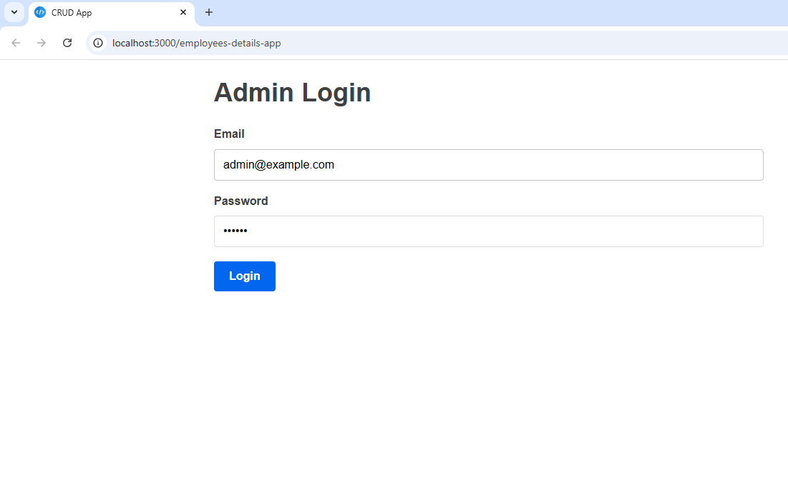
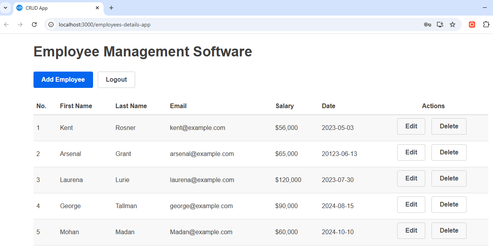
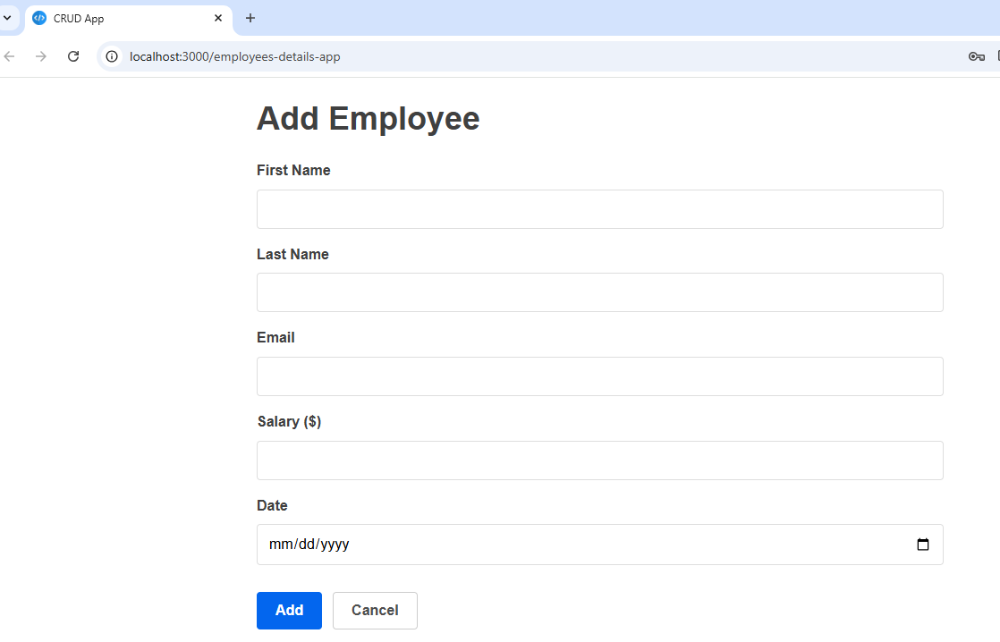
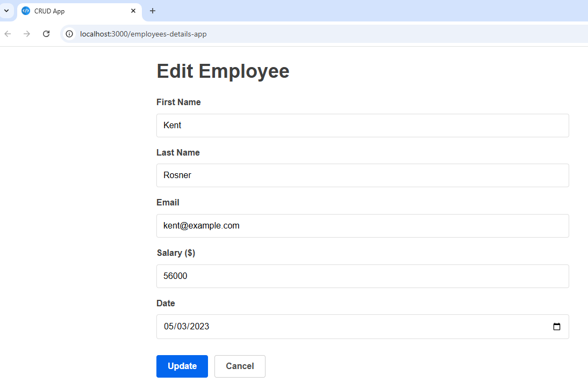
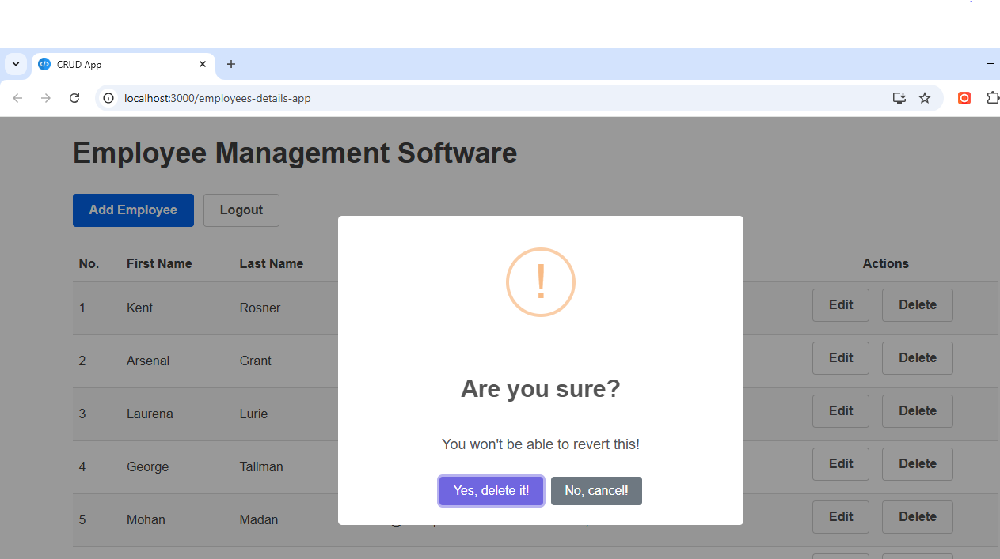

Here’s a clean and professional `README.md` file for your **Employee Management System**, including the uploaded screenshots:

---

```markdown
# 🧑‍💼 Employee Management System

A simple and secure Employee Management System that allows administrators to perform essential operations such as adding, editing, and deleting employee records through a user-friendly dashboard.

## 🚀 Features

- Admin Authentication (Login)
- Add New Employee
- Edit Existing Employee
- Delete Employee
- Dashboard Overview
- Responsive UI

## 🖼️ Screenshots

### 🔐 Admin Login


### 🏠 Admin Dashboard


### ➕ Add Employee


### ✏️ Edit Employee


### ❌ Delete Employee


## 🧰 Tech Stack

- **Frontend:** HTML, CSS, JavaScript (or React if applicable)
- **Backend:** ASP.NET Core / Node.js / (your backend stack here)
- **Database:** Oracle / SQL Server / MongoDB (whichever you're using)

## 📁 Project Structure

```
EmployeeManagement/
├── backend/
├── frontend/
├── screenshots/
│   ├── AdminLogin.PNG
│   ├── AdminDashboard.PNG
│   ├── AddEmp.PNG
│   ├── EditEmp.PNG
│   └── DeleteEmp.PNG
├── README.md
└── ...
```

> Make sure to place all the `.PNG` files inside the `screenshots` directory.

## 🛠️ Setup Instructions

1. Clone the repository:
   ```bash
   git clone https://github.com/yourusername/employee-management-system.git
   ```

2. Add screenshots to the `/screenshots` folder.

3. Install dependencies and run the frontend and backend servers as per your tech stack.

4. Access the app at:
   ```
   http://localhost:3000 (Frontend)
   http://localhost:5000/api (Backend API)
   ```

## ✨ Future Enhancements

- Role-based user access (Admin/HR/Manager)
- Employee Search & Filters
- Pagination in employee list
- Export employee data to PDF/Excel
- Email notifications

## 📄 License

This project is open source and available under the [MIT License](LICENSE).

---

```

### ✅ Next Steps:

1. Create a `screenshots` folder in your project root.
2. Move all your `.PNG` images into it.
3. Save the above content in a `README.md` file at the root of your project.

If you'd like me to help generate a downloadable `README.md` file or update your project folder structure, just let me know!
